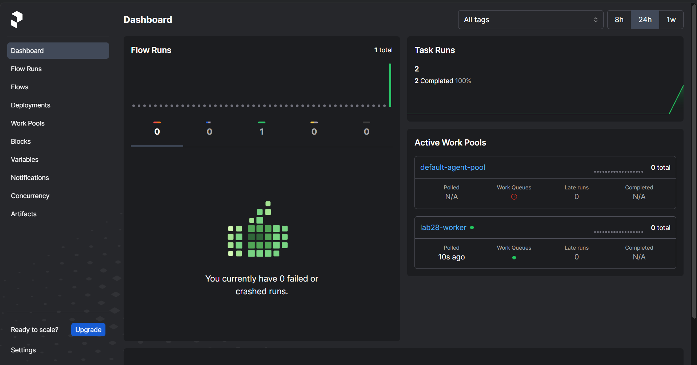
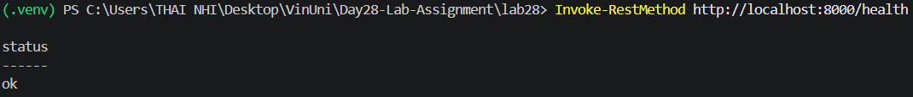
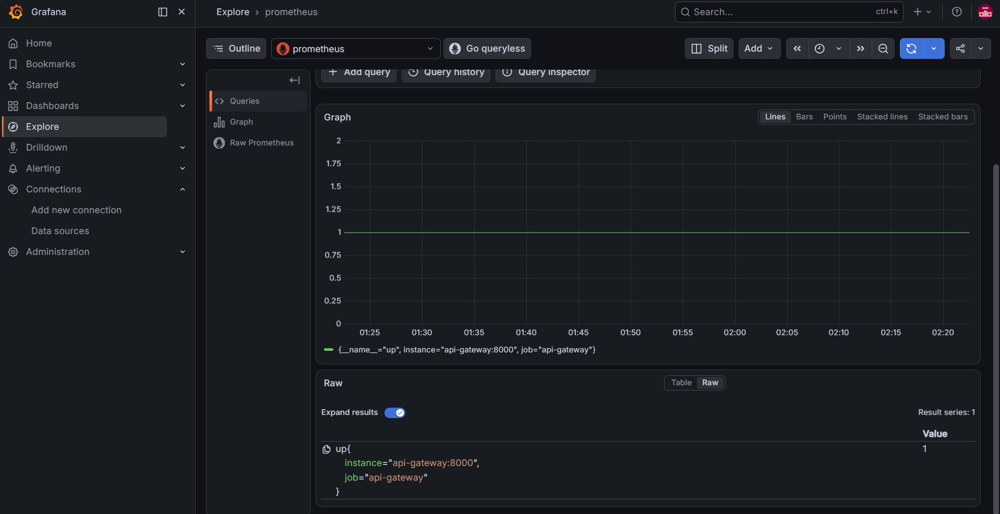
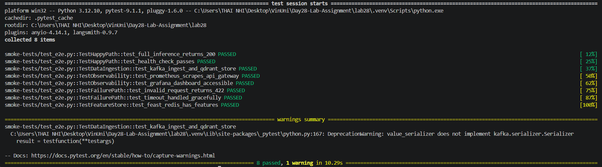
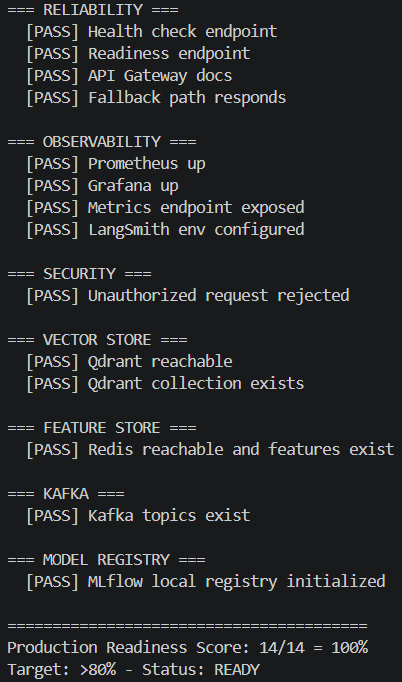
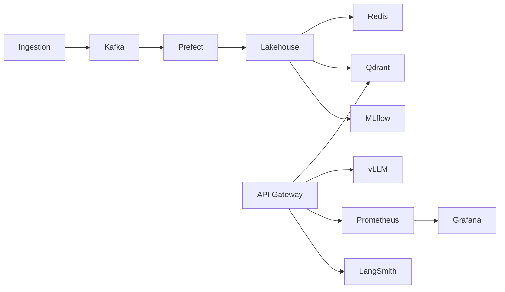

# Lab #28 - Full Platform Integration Sprint

**Sinh viên:** Thái Thị Yến Nhi  
**MSSV:** `2A202600783`

README tổng để giáo viên chấm nhanh: output, hình demo, log, kiến trúc, Day16-Day27 lineage và 5 câu hỏi nộp bài.

## Output cần chấm

| Mục | Link | Kết quả |
|---|---|---|
| Source code | [`lab28/`](lab28/) | Full platform stack |
| Setup guide | [`lab28/README.md`](lab28/README.md) | Hướng dẫn chạy lại |
| Kaggle setup | [`KAGGLE_SETUP.md`](KAGGLE_SETUP.md) | vLLM + embedding API |
| Day16-Day27 map | [`docs/day16-day27-integration-map.md`](docs/day16-day27-integration-map.md) | Cross-day lineage |
| Prefect UI | [`lab28/screenshots/prefect_ui.png`](lab28/screenshots/prefect_ui.png) | Flow/task completed |
| API Gateway | [`lab28/screenshots/api_gateway.png`](lab28/screenshots/api_gateway.png) | Health OK |
| Grafana | [`lab28/screenshots/grafana_dashboard.png`](lab28/screenshots/grafana_dashboard.png) | Prometheus query có data |
| Smoke tests | [`lab28/smoke_tests_results.png`](lab28/smoke_tests_results.png) | `8 passed` |
| Readiness | [`lab28/production_readiness.png`](lab28/production_readiness.png) | `14/14 = 100%` |

## Logs đã verify

```text
model         : Qwen/Qwen2.5-7B-Instruct-GPTQ-Int4
fallback_used : False
context_items : 3
error         :
```

```text
Embedding service OK: received 3 embeddings
Integration 5 OK: stored 3 vectors in Qdrant collection 'documents'
```

```text
Production Readiness Score: 14/14 = 100%
Target: >80% - Status: READY
```

```text
Integration 9 OK: Prometheus metrics flowing for API Gateway
Integration 10 OK: LangSmith traces visible in project lab28-platform
```

## Hình demo











## Architecture



## 10 integration points

1. Data ingestion -> Kafka: `scripts/01_ingest_to_kafka.py`
2. Kafka -> pipeline: `prefect/flows/kafka_to_delta.py`
3. Pipeline -> Lakehouse: local parquet
4. Lakehouse -> Feature Store: Redis
5. Data -> Vector Store: Qdrant
6. MLflow -> Model Registry
7. Model -> vLLM serving
8. Serving -> API Gateway
9. Components -> Prometheus/Grafana
10. Components -> LangSmith tracing

## Day16-Day27 lineage

Lab 28 gom lại các phần đã làm từ Day16 đến Day27: infrastructure, streaming pipeline, lakehouse, feature store, vector store, model serving, MLflow, LangSmith, observability, governance, FinOps, agent routing và data defense. Chi tiết xem [`docs/day16-day27-integration-map.md`](docs/day16-day27-integration-map.md).

## Hướng dẫn chạy nhanh

```bash
cd lab28
cp .env.example .env
docker compose up -d --build
python scripts/01_ingest_to_kafka.py
python prefect/flows/kafka_to_delta.py
python scripts/03_delta_to_feast.py
python scripts/05_embed_to_qdrant.py
pytest smoke-tests/ -v
python scripts/production_readiness_check.py
```

## 5 câu hỏi nộp bài

**1. Trade-offs:** hệ thống ưu tiên reliability và maintainability bằng Docker Compose, scripts tách lớp và fallback path; performance được tăng bằng vLLM khi cần demo thật.

**2. Hybrid disconnect:** nếu Kaggle/vLLM mất kết nối, API Gateway trả fallback response thay vì crash, nên hệ thống graceful degradation.

**3. Kafka decoupling:** producer chỉ publish vào Kafka, downstream như Prefect, Redis, Qdrant xử lý độc lập và có thể replay.

**4. Observability:** Prometheus scrape metrics, Grafana hiển thị dashboard, LangSmith trace chat pipeline, Docker/script logs ghi lại từng integration step.

**5. Service crash:** readiness/production check phát hiện lỗi dependency; API health vẫn tách khỏi batch pipeline; vLLM lỗi thì fallback, Kafka/Redis/Qdrant lỗi thì báo fail rõ ràng.
